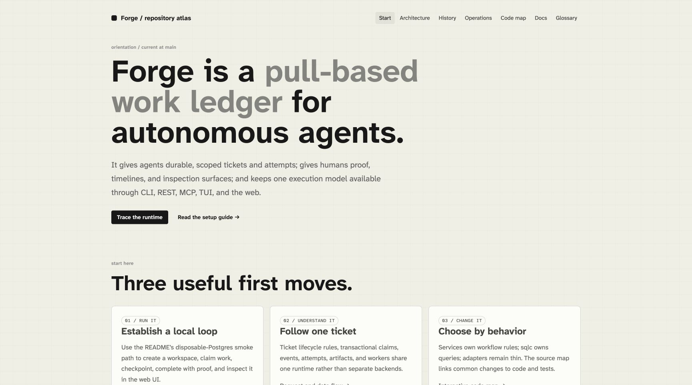

# Repo Atlas

> Turn an unfamiliar codebase into a useful, static onboarding guide.

[Discover on skills.sh](https://www.skills.sh/vivekmaru/repo-atlas/repo-atlas) · [Quick start](#quick-start) · [Demo](#demo)

Repo Atlas creates a browser-ready engineering map: architecture, history,
operations, a behavior-oriented code map, a docs shelf, and a glossary. It
explains relationships and common change paths—not just the directory tree.

## At a glance

| Understand | Get |
| --- | --- |
| System shape | Architecture, request/data-flow, and deployment diagrams |
| Code ownership | An interactive code map and common change recipes |
| Engineering context | History, operations, curated docs, and a domain glossary |
| Source material | Browser-rendered Markdown and specification documents |

By default, output is written to `docs/repo-atlas/` in the target repository.
The generated bundle works from `file://` and a static host.

## Quick start

Install Repo Atlas for Codex, Claude Code, GitHub Copilot, and OpenCode:

```bash
npx skills add https://github.com/vivekmaru/repo-atlas --skill repo-atlas \
  --global --agent codex claude-code github-copilot opencode --yes
```

Then ask your agent:

```text
Create a new-engineer HTML repo atlas for this repository.
```

Omit `--global` to install the skill into the current project for your team.

## Demo

Repo Atlas generated this onboarding guide for the public
[Forge task-tracker repository](https://github.com/vivekmaru/task-tracker).



## Compatibility

Repo Atlas follows the open Agent Skills layout: one `SKILL.md` with standard
`name` and `description` frontmatter, plus relative scripts, references, and
assets. The optional `agents/openai.yaml` metadata enriches Codex only; other
runtimes ignore it.

### OpenCode

OpenCode discovers standard Agent Skills directly, including skills in
`.opencode/skills/`, `.claude/skills/`, and `.agents/skills/`. The quick-start
command above installs the same canonical skill for OpenCode; use
`--agent opencode` alone if that is the only runtime you need.

### Manual installation

<details>
<summary>Use a specific skill directory instead of the installer</summary>

| Runtime | Personal location | Project location |
| --- | --- | --- |
| Claude Code | `~/.claude/skills/repo-atlas` | `.claude/skills/repo-atlas` |
| GitHub Copilot | `~/.copilot/skills/repo-atlas` | `.github/skills/repo-atlas` |
| OpenCode | `~/.config/opencode/skills/repo-atlas` | `.opencode/skills/repo-atlas` |

Clone this repository into the applicable location. Codex users should prefer
the installer, which resolves the active Codex skills directory.

</details>

## Mermaid bundle

Source Mermaid diagrams stay available offline. Repo Atlas intentionally does
not commit the third-party browser bundle; instead it pins Mermaid `11.16.0`
and verifies the npm tarball before extracting it:

```bash
python3 /path/to/repo-atlas/scripts/fetch_mermaid.py \
  docs/repo-atlas/vendor/mermaid.min.js
```

The helper writes Mermaid's MIT license beside the bundle. Use it only when an
atlas contains Mermaid diagrams.

## Registry availability

Repo Atlas is already listed on
[skills.sh](https://www.skills.sh/vivekmaru/repo-atlas/repo-atlas), which
discovers the public repository's root `SKILL.md`. No separate submission is
needed there. For other agent ecosystems, the standard skill directory and a
public Git repository are the distribution mechanism; add the skill to curated
collections only when their maintainers' scope and submission rules fit it.

## License

Repo Atlas is available under the [MIT License](LICENSE). Bundled font notices
are in [THIRD_PARTY_NOTICES.md](THIRD_PARTY_NOTICES.md).
